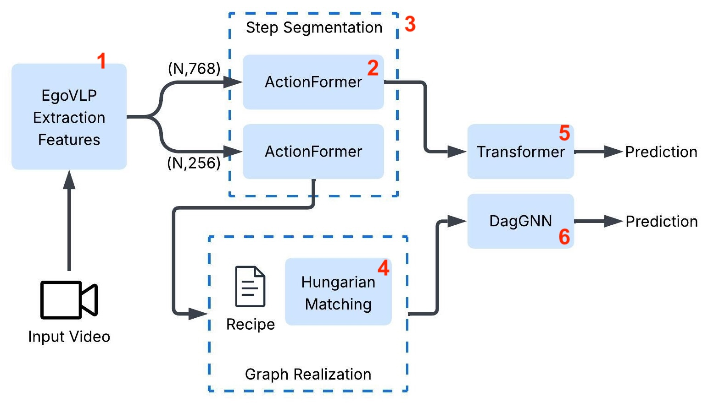

# AML 2025 - Main Repository Information

This repository contains the code and experimental artifacts for the **Mistake Detection** project submitted to **AML 2025 Course**.

The project is organized into multiple branches, each corresponding to a specific experiment, model variant, or replication setting.

## Repository Structure

Each branch is **self-contained** and includes:
- The complete source code for the corresponding experiment
- A dedicated `README.md` with **instructions** to reproduce the results
- Environment and dependency specifications

Please refer to the `README.md` **inside each branch** for detailed replication instructions.

## Branches Overview

### `main`
- Entry point of the repository
- Copy of the CaptainCook base repository
- Pointers to all experimental branches

### `LSTM Baseline`
- Implementation of the LSTM baseline to spot mistakes in single steps

### `features_extraction` (Step 1/2 in the Overview Image)
- EgoVLP to extract features from videos 
- Implementation of ActionFormer to segment videos in Step

### `Substep1-groundtruth` (Step 3)
- Implementation of the step-segmentation using ground truth

### `Hungarian-Matching` (Step 4)
- Computing the graph realizations
- Matching the visual features to the textual ones

### `task-verification-transformer` (Step 5)
- Core implementation of the **Task Verification Transformer** model
- Training and evaluation code for the main architecture
- Baseline results reported in the paper

### `TaskVerification DAGNN` (Step 6)
- Core implementation of the **Task Verification DAGNN** model
- Training and evaluation code for the main architecture
- Baseline results reported in the paper

Each branch contains all the information required to reproduce its results independently.
Other branches represents intermediate experiments that are not relevant in the project.
